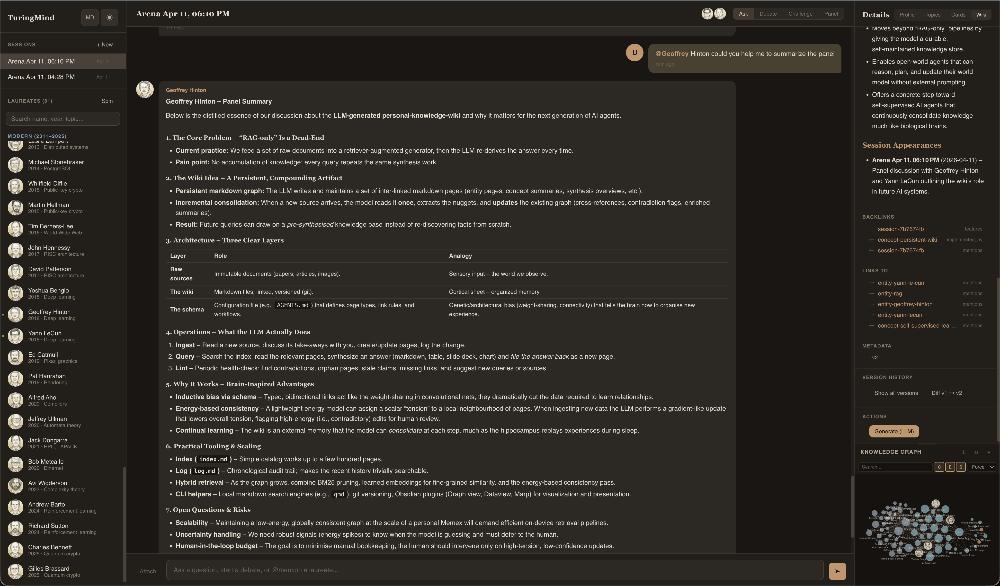

# TuringMind Arena




A multi-agent chat arena where Turing Award laureates come alive, debate your problems, and leave a traceable knowledge graph behind.


Author: Yifan Yang <yfyang86 hotmail>

License: 

- Anything other than avatr: Apache 2.0 
- Avatar: is generated from VLM, CC By 4.0


## Quick Start

```bash
# 1. Clone turingskill cognitive framework data
git clone https://github.com/yfyang86/turingskill.git turingskill

# 2. Configure your LLM provider
#    Edit config.toml — set your API key for at least one provider

# 3. Download dependencies for offline use
uv run python manage.py vendor-deps

# 4. (Optional) Generate portrait avatars from the 9×9 grid image
uv run pip install Pillow
uv run python utils/slice_avatars.py turing-icn-9x9-1080x1080.png

# 5. Check everything is ready
uv run python manage.py health

# 6. Run
uv run server.py
```

Open **http://localhost:8888** in your browser.

## Management CLI

```bash
uv run python manage.py vendor-deps           # Download d3.js, marked.js, fonts for offline use
uv run python manage.py status                # Config, DB, avatars, vendor deps
uv run python manage.py health                # Health checks with fix suggestions
uv run python manage.py sync                  # Git pull turingskill + re-slice avatars
uv run python manage.py lint-wiki             # Wiki health checks
uv run python manage.py export list           # List sessions
uv run python manage.py export <id> -f json   # Export session
```

## Features

### Chat Modes
- **Ask** — question to one or all laureates (@mention to target)
- **Debate** — round-robin with post-debate synthesis
- **Challenge** — Claim → Critique → Rebuttal between two laureates
- **Panel** — laureates discuss autonomously, user observes

### Wiki (Wiki RAG Pattern)
- **Ingest** sessions into a persistent knowledge base — keyword (fast) or LLM (rich 6-step pipeline)
- **Incremental updates** — LLM-generated content preserved on re-ingest, not rewritten
- Concept pages with phase timeline (emerging → established → challenged → revised)
- Entity/disambiguation pages, manual page creation, structured templates
- Content-addressed hash dedup (git-like version chain)
- Version history + line-by-line diff view
- Contradiction detection, wiki lint, consolidation (with ignore)
- Cross-session search, auto cross-linking, auto-index

### Knowledge Graph
- d3.js force-directed with pan/zoom/auto-fit
- Community clustering (label propagation), subgraph focus (shift+click)
- Search highlighting, type filtering (C/E/S), layout modes (force/radial/tree)
- Portrait avatars on entity nodes, export as PNG

### 81 Laureate Agents
- All Turing Award winners 1966–2025 from [turingskill](https://github.com/yfyang86/turingskill)
- BM25 search, Chinese name support, topic-match auto-recommend
- Portrait avatars (sliced from 9×9 grid), card collection, thinking style badge

## Configuration

```toml
[default]
provider = "openai"

[providers.openai]
type = "openai"
api_base = "https://api.openai.com/v1"
api_key = "sk-YOUR-KEY"
model = "gpt-4o"

[wiki]
heartbeat_timeout_s = 5    # Stall detection for LLM calls
generation_timeout_s = 600 # Total timeout for LLM generation
max_context_length = 20000 # Max input context (characters)

[arena]
max_laureates_per_room = 5
debate_max_rounds = 3
```

## Tech Stack

| Layer | Choice |
|-------|--------|
| Server | Tornado (Python 3.12, uv) |
| Frontend | Vanilla HTML/CSS/JS (no build step) |
| Database | DuckDB (12 tables, embedded) |
| LLM | httpx async streaming (6 provider types) |
| Graph | d3.js v7 (vendored locally) |
| Markdown | marked.js v15 (vendored, optional toggle) |
| Search | BM25 (pure Python) |

## Project Structure

```
turingmind-arena/
├── server.py                 # 38 routes, config validation, hot-reload
├── manage.py                 # CLI: vendor-deps, status, health, sync, export
├── config.toml               # LLM providers + wiki timeouts + arena settings
├── core/
│   ├── wiki_engine.py        # Wiki: ingest, templates, consolidation, diff, graph
│   ├── llm_router.py         # Multi-provider streaming, wiki timeouts, retry
│   ├── agent_manager.py      # 81 laureates, BM25, recommend, presets
│   ├── session_manager.py    # DuckDB CRUD, topics, export
│   ├── topic_tracker.py      # Keyword topic extraction
│   └── avatar_gen.py         # SVG fallback avatars
├── handlers/
│   ├── chat.py               # WebSocket: ask/debate/challenge/panel
│   ├── api.py                # REST: sessions, laureates, topics, avatars
│   ├── upload.py             # File upload + text extraction
│   └── wiki.py               # REST: wiki pages, ingest, graph, diff, consolidate
├── utils/
│   └── slice_avatars.py      # Slice 9×9 portrait grid → 81 avatars
├── db/schema.sql             # 12 DuckDB tables
├── static/
│   ├── js/arena.js           # Full SPA client (~2,160 lines)
│   ├── css/arena.css         # Dark/light themes (~1,710 lines)
│   ├── img/avatars/          # 324 PNG portrait files
│   └── vendor/               # d3.js, marked.js, fonts (after vendor-deps)
├── templates/index.html      # Layout with KG toolbar
├── UI_PRINCIPLES.md          # Symbol vs text label policy
└── RC3_ROADMAP.md            # Planning doc
```

## Documents

- **UI_PRINCIPLES.md** — keep universal symbols (☰ ➤ × ☀ ☾), use text for domain actions
- **RC3_ROADMAP.md** — planning document for graph/wiki/multi-user features
- **TaskList.md** — 170 completed tasks across RC1–RC3
