# TuringMind Arena — User Manual

> **Version:** RC3 | **Last Updated:** 2026-04-12 | **~8,200 lines of code**

---

## Table of Contents

1. [Overview](#1-overview)
2. [Installation](#2-installation)
3. [Configuration](#3-configuration)
4. [Architecture](#4-architecture)
5. [File Structure](#5-file-structure)
6. [Features Guide](#6-features-guide)
7. [Wiki RAG System](#7-wiki-rag-system)
8. [Knowledge Graph](#8-knowledge-graph)
9. [Chat Modes](#9-chat-modes)
10. [Management CLI](#10-management-cli)
11. [Database Schema](#11-database-schema)
12. [API Reference](#12-api-reference)
13. [Sequence Diagrams](#13-sequence-diagrams)
14. [Design Decisions](#14-design-decisions)
15. [Development Guide](#15-development-guide)
16. [Troubleshooting](#16-troubleshooting)

---

## 1. Overview

TuringMind Arena is a multi-agent chat application where **81 Turing Award laureates** (1966–2025) come alive as AI personas. You can chat with them individually, watch them debate, and build a persistent **Wiki knowledge base** from your conversations — inspired by Andrej Karpathy's "LLM Wiki" pattern.

### Core Concepts

- **Session** — A chat room. Add 1–5 laureates, then talk, debate, or challenge.
- **Agent** — A laureate persona with a unique cognitive framework, thinking style, and system prompt sourced from the [turingskill](https://github.com/yfyang86/turingskill) dataset.
- **Wiki** — A persistent knowledge base built from session conversations. Pages are concepts, entities, or session summaries. Links between pages form a knowledge graph.
- **Knowledge Graph** — A d3.js force-directed graph visualization of the wiki, with clustering, search, filtering, and multiple layout modes.

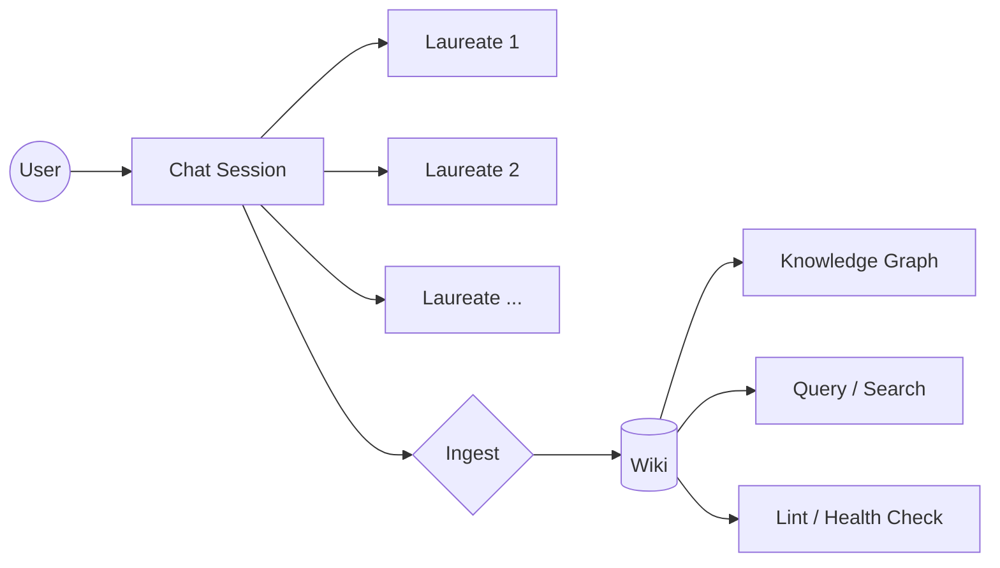

---

## 2. Installation

### Prerequisites

| Tool | Version | Purpose |
|------|---------|---------|
| Python | 3.12+ | Runtime |
| [uv](https://docs.astral.sh/uv/) | Latest | Package manager + virtual env |
| Git | Any | Clone turingskill data |

### Steps

```bash
# 1. Clone the turingskill cognitive framework data
git clone https://github.com/yfyang86/turingskill.git turingskill

# 2. Configure your LLM provider (at least one)
#    Edit config.toml — set your API key
cp config.toml config.toml.bak
nano config.toml

# 3. Download local dependencies for offline use
uv run python manage.py vendor-deps

# 4. (Optional) Generate portrait avatars from a 9×9 grid image
uv run pip install Pillow
uv run python utils/slice_avatars.py turing-icn-9x9-1080x1080.png

# 5. Health check
uv run python manage.py health

# 6. Start the server
uv run server.py
```

Open **http://localhost:8888** in your browser.

### Environment Variables

| Variable | Default | Description |
|----------|---------|-------------|
| `PORT` | `8888` | Server listening port |

---

## 3. Configuration

All configuration lives in `config.toml`:

```toml
[default]
provider = "openai"           # Which provider to use by default

[providers.openai]
type = "openai"               # "openai" or "claude"
api_base = "https://api.openai.com/v1"
api_key = "sk-YOUR-KEY"
model = "gpt-4o"

[providers.claude]
type = "claude"
api_base = "https://api.anthropic.com"
api_key = "sk-ant-YOUR-KEY"
model = "claude-sonnet-4-20250514"

[providers.deepseek]
type = "openai"
api_base = "https://api.deepseek.com/v1"
api_key = "YOUR-KEY"
model = "deepseek-chat"

[providers.local_vllm]
type = "openai"
api_base = "http://localhost:8000/v1"
api_key = "dummy"
model = "Qwen/Qwen2.5-72B-Instruct"

[arena]
max_laureates_per_room = 5    # Max laureates per session
debate_max_rounds = 3         # Rounds in debate/panel mode
typing_delay_ms = 800         # Simulated typing delay

[wiki]
heartbeat_timeout_s = 5       # Per-chunk read timeout (stall detection)
generation_timeout_s = 600    # Total timeout for LLM generation
max_context_length = 20000    # Max input context chars sent to LLM

[data]
turingskill_path = "./turingskill"
duckdb_path = "./turingmind.duckdb"
debug = false                 # Enable debug logging + Tornado auto-reload
```

### Per-Laureate Provider Override

You can route specific laureates to different LLM providers:

```toml
[laureate_providers]
"geoffrey-hinton" = "claude"
"yoshua-bengio" = "deepseek"
```

### Hot Reload

Config changes are detected every 5 seconds and applied without restart. Provider changes, timeout adjustments, and arena settings take effect immediately.

---

## 4. Architecture

### System Architecture

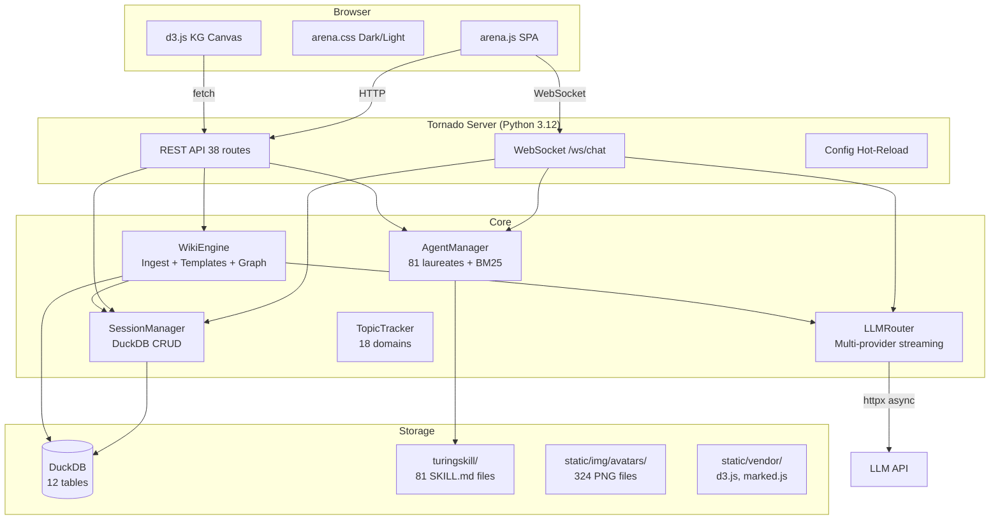

### Request Flow

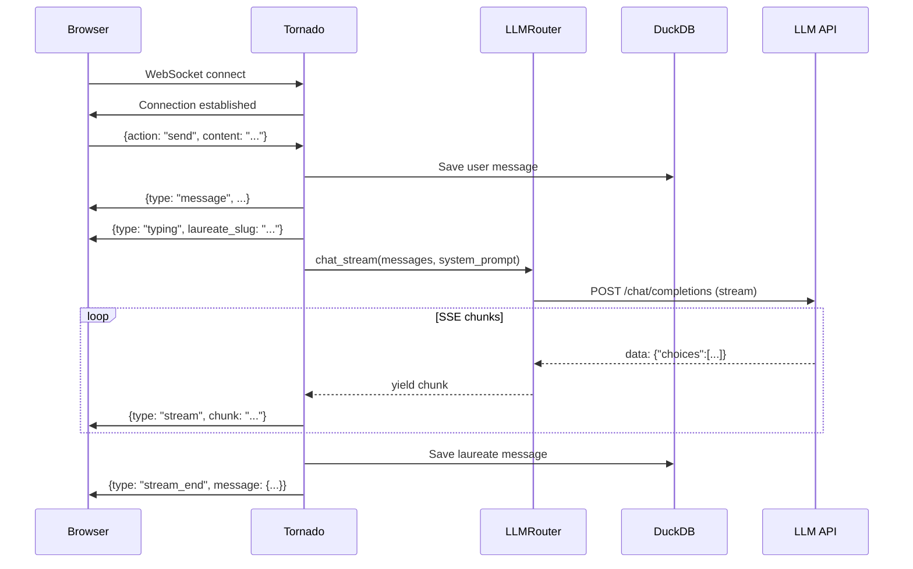

### Tech Stack

| Layer | Technology | Why |
|-------|-----------|-----|
| Server | Tornado 6.4+ | Async WebSocket + HTTP, no build step |
| Database | DuckDB 1.1+ | Embedded, SQL, no server process |
| LLM Client | httpx 0.27+ | Async streaming, configurable timeouts |
| Frontend | Vanilla JS/CSS | No build step, offline-capable |
| Graph | d3.js v7 | Canvas2D force simulation |
| Markdown | marked.js v15 | Optional toggle rendering |
| Package | uv + hatchling | Fast Python environment |

---

## 5. File Structure

```
turingmind-arena/
├── server.py                   # Entry point: 38 routes, config validation, hot-reload
├── manage.py                   # CLI: vendor-deps, status, health, sync, lint-wiki, export
├── config.toml                 # LLM providers, arena settings, wiki timeouts
├── pyproject.toml              # Python project metadata + dependencies
│
├── core/                       # Business logic layer
│   ├── __init__.py
│   ├── agent_manager.py        # 81 laureate personas, BM25 search, recommend, presets
│   ├── avatar_gen.py           # SVG medallion fallback generator
│   ├── llm_router.py           # Multi-provider streaming, retry/backoff, wiki timeouts
│   ├── session_manager.py      # DuckDB CRUD for sessions, messages, topics
│   ├── topic_tracker.py        # Keyword extraction (18 domain categories)
│   └── wiki_engine.py          # Wiki: ingest, templates, consolidation, diff, graph
│
├── handlers/                   # HTTP/WS request handlers
│   ├── __init__.py
│   ├── api.py                  # REST: sessions, laureates, topics, avatars, collection
│   ├── chat.py                 # WebSocket: ask/debate/challenge/panel, synthesis
│   ├── upload.py               # File upload + text extraction (25+ types)
│   └── wiki.py                 # REST: wiki pages, ingest, graph, diff, consolidate
│
├── utils/
│   └── slice_avatars.py        # Slice 9×9 portrait grid → 81 × 4 sizes
│
├── db/
│   └── schema.sql              # 12 DuckDB tables
│
├── static/
│   ├── js/arena.js             # Full SPA (~2,160 lines)
│   ├── css/arena.css           # Dark/light themes (~1,710 lines)
│   ├── img/avatars/            # 324 PNG portrait files (81 laureates × 4 sizes)
│   └── vendor/                 # d3.js, marked.js, Google Fonts (after vendor-deps)
│
├── templates/
│   └── index.html              # Layout with KG toolbar
│
├── turingskill/                # External: 81 SKILL.md cognitive frameworks (git submodule)
│
├── RC-CodeReview.md            # Code review (18 issues found, 14 fixed)
├── RC3_ROADMAP.md              # Planning doc for graph/wiki/multi-user features
├── TaskList.md                 # 170 completed tasks across RC1–RC3
├── UI_PRINCIPLES.md            # Symbol vs text label design policy
└── README.md                   # Quick start guide
```

### Lines of Code

| File | Lines | Role |
|------|-------|------|
| `core/wiki_engine.py` | ~1,700 | Largest: wiki ingest pipeline, templates, graph, diff |
| `static/js/arena.js` | ~2,160 | Full SPA client |
| `static/css/arena.css` | ~1,710 | Complete theme system |
| `core/agent_manager.py` | ~380 | Laureate loading + search |
| `manage.py` | ~280 | CLI tool |
| `handlers/chat.py` | ~213 | WebSocket chat logic |
| Other files | ~1,750 | Remaining handlers, utils, server |
| **Total** | **~8,200** | |

---

## 6. Features Guide

### 6.1 Three-Panel Layout

```
┌──────────┬─────────────────────┬──────────────┐
│ Left     │ Center              │ Right        │
│ Panel    │ Panel               │ Panel        │
│          │                     │              │
│ Laureate │ Chat messages       │ Profile      │
│ list     │ with streaming      │ Wiki pages   │
│          │ responses           │ Topics       │
│ Sessions │                     │ Cards        │
│          │                     │ Lint report  │
│ Search   │ Input bar           │              │
│          │ with @mention       │              │
│          │ + file upload       ├──────────────┤
│          │                     │ Knowledge    │
│          │                     │ Graph        │
│          │                     │ (collapsible)│
└──────────┴─────────────────────┴──────────────┘
```

### 6.2 Laureate Agents

81 Turing Award winners loaded from `turingskill/` SKILL.md files. Each agent has:

- **System prompt** — thinking style, era context, cognitive framework
- **BM25 searchable** — search by name, contribution, keywords, Chinese name
- **Topic matching** — auto-recommend laureates based on your chat topic
- **Presets** — "era clash" (pioneers vs modern) and "thinking duel" (opposing styles)

### 6.3 Dark/Light Themes

Toggle with ☀/☾ button in the header. 74+ CSS variables for consistent theming. The Knowledge Graph automatically adapts colors.

### 6.4 Keyboard Shortcuts

| Key | Action |
|-----|--------|
| `Ctrl+Enter` | Send message |
| `Ctrl+K` | Focus search |
| `@` | Open laureate mention autocomplete |

### 6.5 File Upload

Drag & drop or click the Attach button. Supports 25+ file types:

| Category | Formats |
|----------|---------|
| Documents | `.txt`, `.md`, `.html`, `.csv`, `.json`, `.xml`, `.yaml` |
| Code | `.py`, `.js`, `.ts`, `.java`, `.c`, `.cpp`, `.rs`, `.go`, `.rb`, `.sh` |
| Data | `.csv`, `.tsv`, `.json` |
| PDF | `.pdf` (via `pypdf` if installed) |

Extracted text is appended to your message as context for the laureates.

---

## 7. Wiki RAG System

The wiki implements Karpathy's LLM Wiki pattern: **Ingest → Query → Lint**.

### 7.1 Wiki Operations

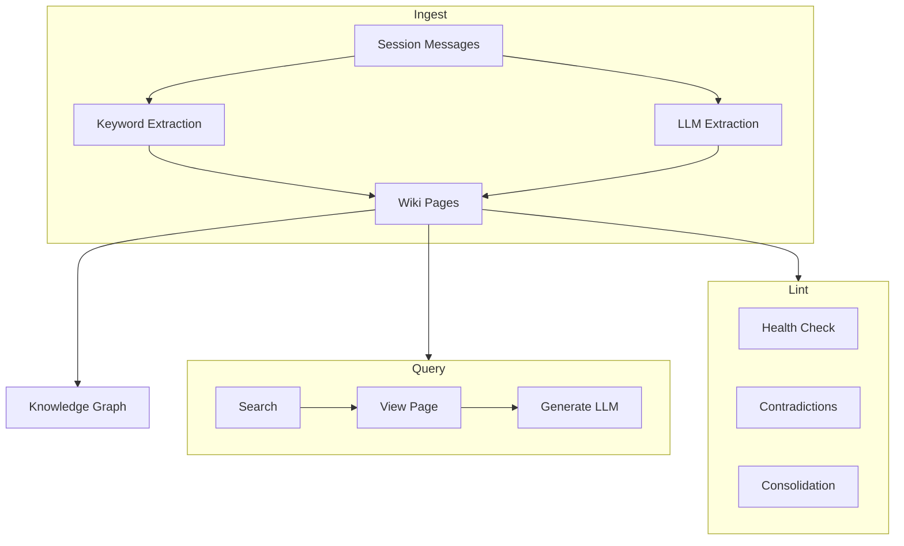

### 7.2 Ingest Pipeline

Two modes, selectable via the `☐ LLM` toggle in the Wiki tab:

#### Keyword Ingest (Default, Fast)

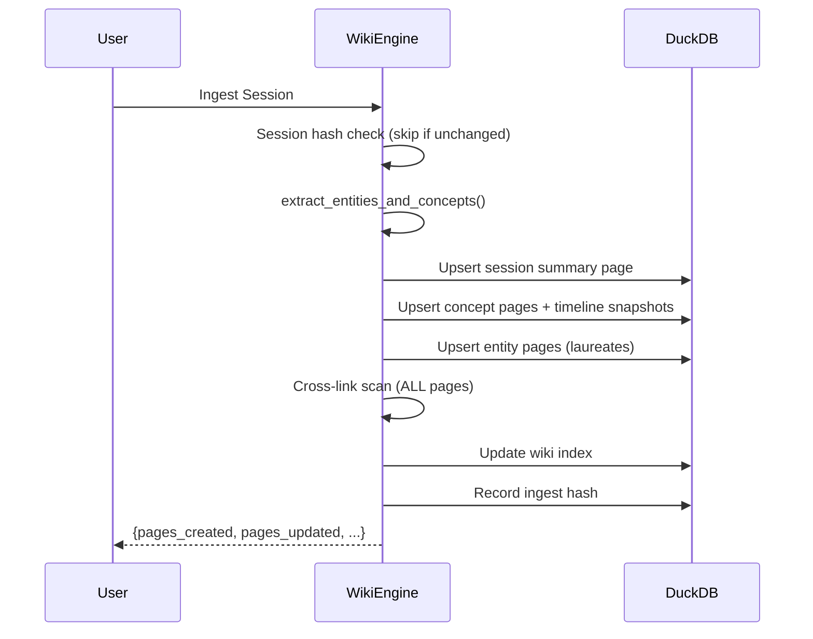

#### LLM Ingest (Rich, 6-Step Pipeline)

```mermaid
sequenceDiagram
    participant U as User
    participant W as WikiEngine
    participant LLM as LLM API
    participant DB as DuckDB

    U->>W: Ingest Session (LLM mode)
    W->>W: Hash check (skip if unchanged)

    rect rgb(40,40,60)
        Note over W,LLM: Step 1: LLM Extraction
        W->>LLM: Transcript + existing pages
        LLM-->>W: JSON {entities, concepts, cross_refs, classifications}
    end

    rect rgb(40,60,40)
        Note over W,DB: Step 2: Classify Manual Pages
        W->>DB: Reclassify manual pages per LLM
    end

    rect rgb(60,40,40)
        Note over W,DB: Step 3: Create/Update Pages
        W->>DB: Session summary
        W->>DB: Entity pages (LLM-extracted)
        W->>DB: Concept pages (incremental: body preserved)
        W->>DB: Cross-reference links
        W->>DB: Keyword entity extraction (laureates)
    end

    rect rgb(40,40,60)
        Note over W,DB: Step 4: Rebuild ALL Links
        W->>W: Scan every page for every title
        W->>DB: add_link for each mention
    end

    rect rgb(60,60,40)
        Note over W,LLM: Step 5: Regenerate Affected
        W->>W: Find neighbors of changed pages
        W->>LLM: Generate for placeholder pages
        W->>DB: Update affected pages
    end

    W->>DB: Step 6: Update index + log
    W-->>U: {pages_created, updated, regenerated, ...}
```

### 7.3 Page Types

| Type | Slug Prefix | Description |
|------|-------------|-------------|
| `concept` | `concept-` | Ideas, techniques, theories. Has Definition, Introduction, Synonyms, Use Scenarios, Examples, Timeline. |
| `entity` | `entity-` | People, tools, organizations. Has Overview, Key Contributions, Connections. |
| `session_summary` | `session-` | Auto-generated overview of a chat session. |
| `disambiguation` | `disambig-` | When a term has multiple meanings. |
| `index` | `_index` | Auto-generated catalog of all pages. |

### 7.4 Content-Addressed Dedup

Three-layer hash chain prevents redundant writes:

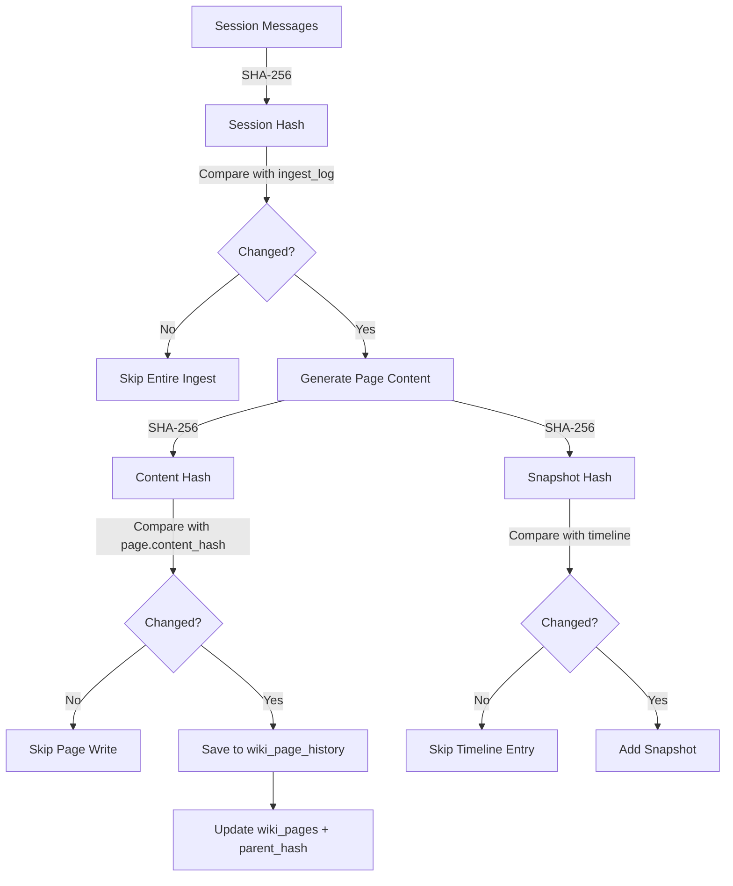

### 7.5 Incremental LLM Updates

When a page already has LLM-generated content:

- **Normal Generate (LLM):** Sends existing body + new context to LLM. LLM evaluates and outputs `NO_CHANGE` if the page is already accurate, or a merged update.
- **Force Rewrite:** Bypasses evaluation. Always uses the full template prompt to regenerate from scratch.
- **On Re-Ingest:** Existing LLM-generated body sections are preserved. Only the Timeline section is rebuilt with new entries.

### 7.6 Wiki UI

```
┌─────────────────────────────────────┐
│ ◐ Generating page via LLM...       │  ← Status bar (hidden when idle)
├─────────────────────────────────────┤
│ [Search...]                         │
├─────────────────────────────────────┤
│ [Ingest Session] [Ingest All] ☐LLM │
│ [Lint] [Consolidate]               │
├─────────────────────────────────────┤
│ [New page title...] [Add]          │
├─────────────────────────────────────┤
│ 12 pages · 35 links · 8 timeline   │
├─────────────────────────────────────┤
│  📄 Artificial Intelligence  v3    │
│  📄 Deep Learning           v2    │
│  📄 Transformer Architecture v1   │
│  👤 Geoffrey Hinton          v2    │
│  📋 Session: ML Discussion   v1    │
└─────────────────────────────────────┘
```

**Page View Actions:**
- **Generate (LLM)** — Incremental update, may return "no changes needed"
- **Force Rewrite** — Full regeneration, always rewrites
- **View History** — See all versions with line-by-line diff

---

## 8. Knowledge Graph

### 8.1 Toolbar

```
┌─ Knowledge Graph ──────────── ⤓ ↻ ▾ ┐
│ [Search...] [C][E][S] [Force ▾]     │
│                                       │
│    ● concept (clustered)              │
│   / \                                 │
│ [👤]  ● concept                       │
│   \                                   │
│    ○ session                          │
│                                       │
└───────────────────────────────────────┘
```

### 8.2 Interactions

| Action | Effect |
|--------|--------|
| **Click** node | Opens wiki page in right panel |
| **Shift+click** node | Focus: show only N-hop subgraph around that node |
| **Double-click** canvas | Clear focus (if active) or fit-all (if no focus) |
| **Scroll wheel** | Zoom in/out (toward cursor) |
| **Drag** canvas | Pan view |
| **Hover** node | Show tooltip with title + type + degree |

### 8.3 Features

| Feature | Description |
|---------|-------------|
| **Clustering** (R3.1) | Label propagation algorithm. 10-color palette. Nodes colored by community. |
| **Subgraph** (R3.2) | Shift+click for BFS N-hop neighborhood. Server-side via `?focus=&hops=`. |
| **Search** (R3.3) | Toolbar input. Yellow highlight ring on matches. Neighbors stay visible. |
| **Filtering** (R3.4) | C/E/S toggle buttons: show/hide Concept/Entity/Session nodes. |
| **Layout** (R3.5) | Force (d3 simulation), Radial (BFS rings from hub), Tree (sessions→concepts→entities). |
| **Export** (R3.6) | ⤓ button saves canvas as `turingmind-knowledge-graph.png`. |
| **Radius Cap** | Max 16px visual, 22px collision — prevents hub nodes from dominating. |
| **Portraits** | Entity nodes show circular-clipped portrait avatars. |
| **Theme** | 12 CSS vars, auto-adapts to dark/light. |

---

## 9. Chat Modes

### 9.1 Ask (Default)

Send a message. If `@mention` targets a specific laureate, only that agent responds. Otherwise, all session laureates respond in order.

### 9.2 Debate

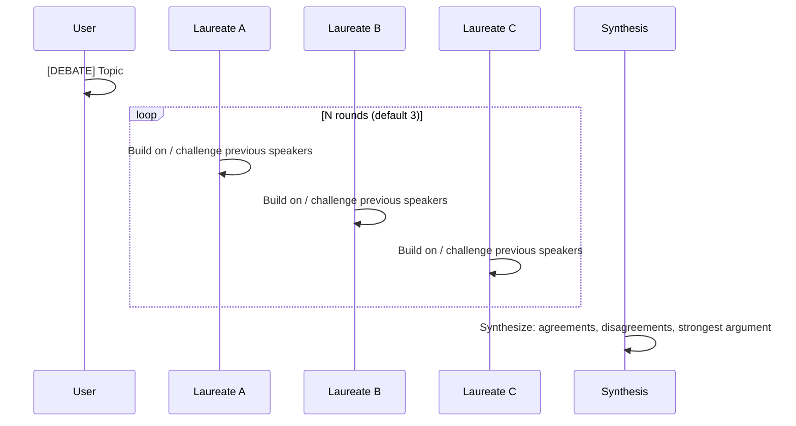

### 9.3 Challenge

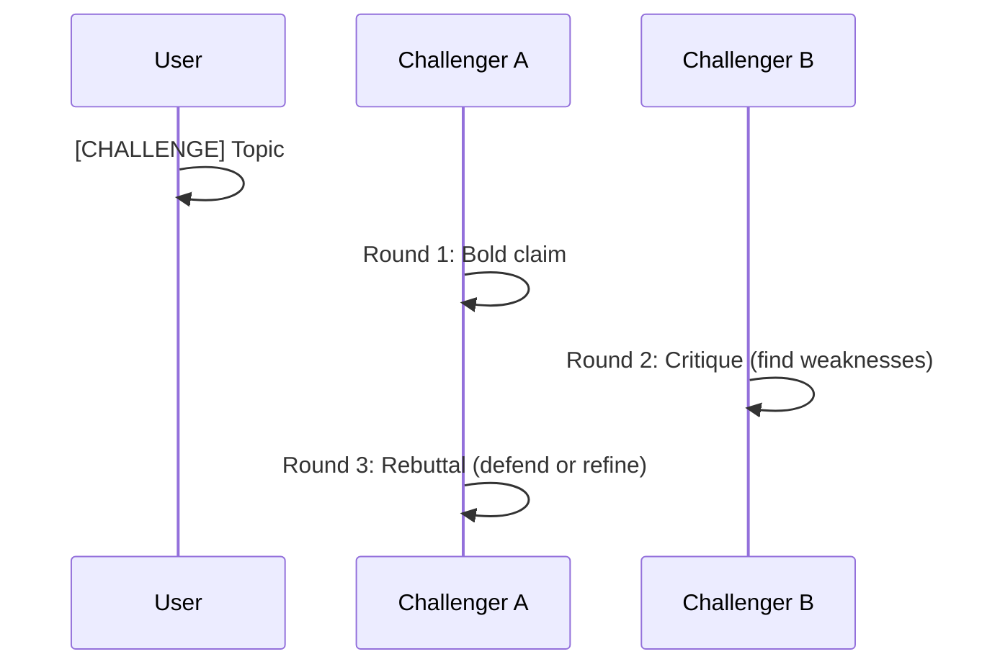

### 9.4 Panel

Laureates discuss among themselves. User observes. Each laureate addresses others by name.

---

## 10. Management CLI

```bash
uv run python manage.py <command>
```

| Command | Description |
|---------|-------------|
| `vendor-deps` | Download d3.js v7, marked.js v15, Google Fonts → `static/vendor/` |
| `status` | Show config, DB stats, avatar count, vendor deps |
| `health` | 12 health checks with fix suggestions |
| `sync` | Git pull turingskill + re-slice avatars |
| `lint-wiki` | Run wiki health checks (orphans, broken links, etc.) |
| `export list` | List all sessions |
| `export <id> [-f json\|md]` | Export session as markdown or JSON |

### Health Checks

| Check | What It Verifies |
|-------|------------------|
| Config file | `config.toml` exists and parses |
| Default provider | Named provider exists in `[providers]` |
| API keys | Not placeholder values (`YOUR-KEY`) |
| DuckDB | Database opens and tables exist |
| turingskill | Path exists with SKILL.md files |
| Avatars | PNG files in `static/img/avatars/` |
| Vendor deps | d3.js and marked.js in `static/vendor/` |
| Wiki pages | At least one page exists |

---

## 11. Database Schema

12 tables in DuckDB:

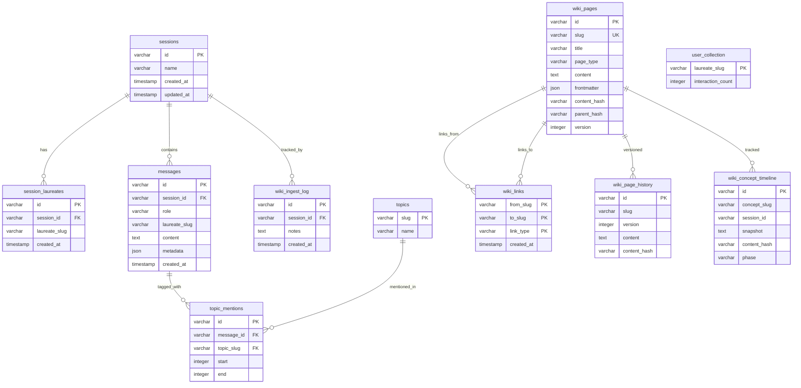

---

## 12. API Reference

### Sessions

| Method | Endpoint | Description |
|--------|----------|-------------|
| `GET` | `/api/sessions` | List all sessions |
| `POST` | `/api/sessions` | Create session `{name}` |
| `DELETE` | `/api/sessions/:id` | Delete session |
| `PATCH` | `/api/sessions/:id` | Rename `{name}` |
| `GET` | `/api/sessions/:id/laureates` | List laureates in session |
| `POST` | `/api/sessions/:id/laureates` | Add laureate `{slug}` |
| `GET` | `/api/sessions/:id/messages` | Get message history |
| `GET` | `/api/sessions/:id/export` | Export as MD or JSON `?format=` |

### Laureates

| Method | Endpoint | Description |
|--------|----------|-------------|
| `GET` | `/api/laureates` | List all 81 laureates |
| `GET` | `/api/laureates/search?q=` | BM25 search |
| `GET` | `/api/laureates/by-era` | Group by era |
| `GET` | `/api/laureates/recommend?topic=` | Auto-recommend for topic |
| `GET` | `/api/laureates/presets` | Era clash + thinking duel presets |
| `GET` | `/api/avatar/:slug` | Portrait PNG (with SVG fallback) |

### Wiki

| Method | Endpoint | Description |
|--------|----------|-------------|
| `GET` | `/api/wiki/stats` | Page/link/timeline counts |
| `POST` | `/api/wiki/ingest` | Ingest session `{session_id, use_llm?, force?}` |
| `POST` | `/api/wiki/ingest-all` | Ingest all sessions `{use_llm?}` |
| `POST` | `/api/wiki/add` | Create manual page `{title, page_type?}` |
| `GET` | `/api/wiki/pages` | List pages `?type=` |
| `GET` | `/api/wiki/pages/:slug` | Get page with links |
| `DELETE` | `/api/wiki/pages/:slug` | Delete page |
| `GET` | `/api/wiki/search?q=` | Search (title + slug + content) |
| `GET` | `/api/wiki/graph` | Graph data `?focus=&hops=` |
| `GET` | `/api/wiki/log?limit=` | Activity log |
| `GET` | `/api/wiki/lint` | Health check |
| `GET` | `/api/wiki/concept-timeline/:slug` | Concept phase timeline |
| `GET` | `/api/wiki/pages/:slug/history` | Version history |
| `GET` | `/api/wiki/pages/:slug/diff?v1=&v2=` | Line-by-line diff |
| `GET` | `/api/wiki/contradictions` | Detect contradictions |
| `GET` | `/api/wiki/related?ignore=` | Find consolidation candidates |
| `POST` | `/api/wiki/consolidate` | Merge pages `{primary, merge[]}` |
| `POST` | `/api/wiki/generate` | LLM generate `{slug, force?}` |
| `POST` | `/api/wiki/disambiguate` | Create disambiguation `{term, entries[]}` |

### Topics & Other

| Method | Endpoint | Description |
|--------|----------|-------------|
| `GET` | `/api/topics` | List tracked topics |
| `POST` | `/api/topics/add` | Add topic `{name}` (+ creates wiki page) |
| `GET` | `/api/topics/timeline?name=` | Mention timeline for hype cycle |
| `POST` | `/api/upload` | File upload (multipart) |
| `GET` | `/api/collection` | Card collection |
| `GET` | `/api/messages/search?q=` | Cross-session message search |

### WebSocket

Connect to `/ws/chat`, send JSON:

| Action | Payload | Response Types |
|--------|---------|---------------|
| `join` | `{action:"join", session_id}` | `history` |
| `send` | `{action:"send", content, target?}` | `message`, `typing`, `stream`, `stream_end` |
| `debate` | `{action:"debate", content}` | `typing`, `stream`, `stream_end`, `debate_end` |
| `challenge` | `{action:"challenge", content, challengers?}` | `challenge_start/end`, `stream` |
| `panel` | `{action:"panel", content}` | `panel_start/end`, `stream` |
| `ping` | `{action:"ping"}` | `pong` |

---

## 13. Sequence Diagrams

### Wiki Ingest → Graph Update

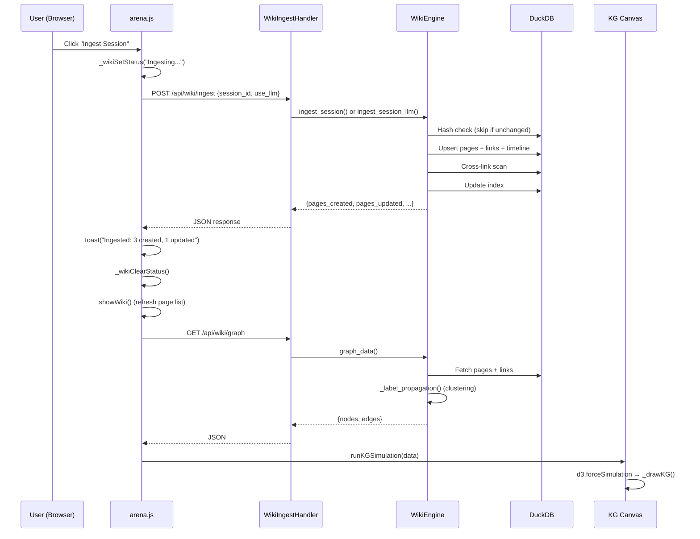

### Manual Page → LLM Generate → Knowledge Graph

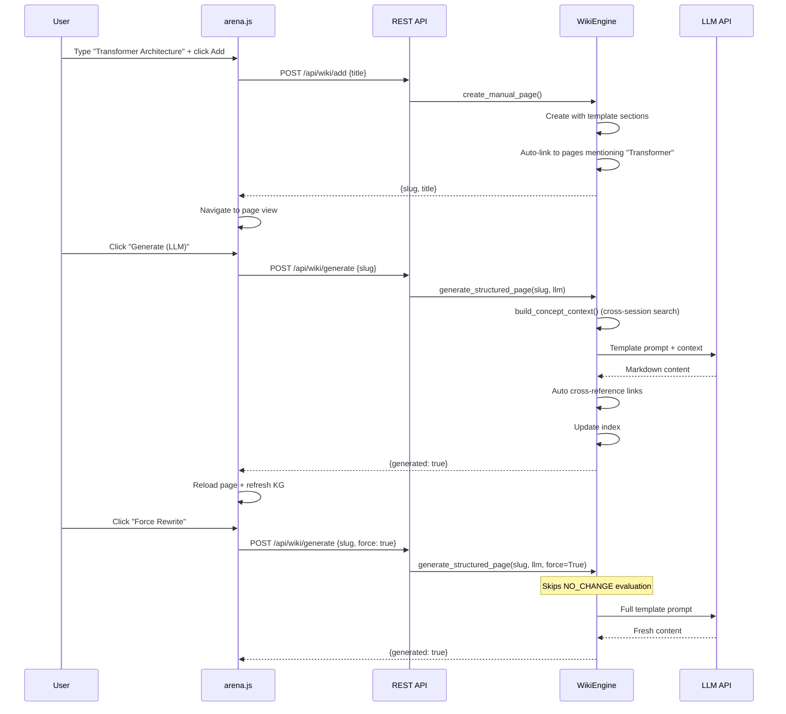

### Consolidation Flow

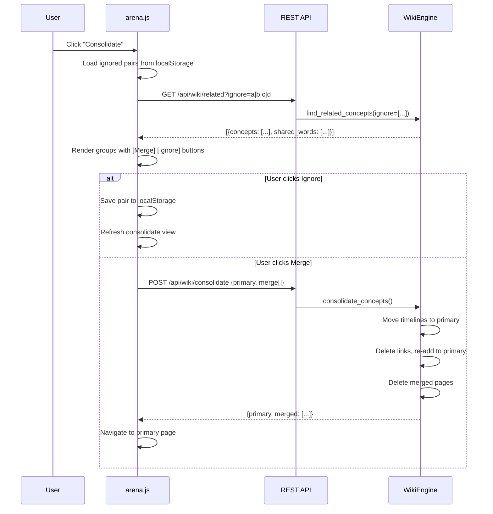

---

## 14. Design Decisions

### Why No Embedding/Vector Search?

BM25 keyword search + DuckDB ILIKE is sufficient for ~100s of pages. No embedding infrastructure needed. The wiki index page serves as a table of contents that the LLM reads to find relevant pages — this mirrors Karpathy's approach.

### Why Vanilla JS (No React/Vue)?

- No build step → works offline, loads instantly
- Single `arena.js` file → easy to debug
- d3.js needs direct Canvas2D access → framework overhead unnecessary
- Total JS is ~2,160 lines — manageable without a framework

### Why DuckDB (Not SQLite)?

- ILIKE operator for case-insensitive search
- JSON column type for frontmatter
- Better analytical queries for stats/aggregation
- Single-file embedded, no server process

### UI Principles (`UI_PRINCIPLES.md`)

- **Universal symbols stay:** ☰ (menu), ➤ (send), × (close), ☀/☾ (theme), ℹ (info)
- **Domain actions get text:** "Challenge", "Ingest", "Generate (LLM)", "Force Rewrite", "Lint"
- **Reason:** Domain-specific emojis (🧪🔬📡) are ambiguous. Text is unambiguous.

### Incremental LLM Updates

- Problem: every ingest destroyed LLM-generated content (Definition, Introduction sections)
- Solution: check `frontmatter.generated_by_llm` flag → preserve body, only update Timeline
- For `generate_structured_page`: send existing body to LLM → "if accurate, output NO_CHANGE"
- Force Rewrite button for when you want a full regeneration

---

## 15. Development Guide

### Adding a New LLM Provider

1. Add to `config.toml`:
   ```toml
   [providers.my_provider]
   type = "openai"   # Use "openai" for any OpenAI-compatible API
   api_base = "https://api.example.com/v1"
   api_key = "YOUR-KEY"
   model = "my-model"
   ```
2. Set as default: `[default] provider = "my_provider"`
3. Config hot-reloads within 5 seconds.

### Adding a New Wiki Page Type

1. Add template to `WikiEngine.TEMPLATES` in `core/wiki_engine.py`:
   ```python
   "my_type": {
       "sections": ["Overview", "Details"],
       "prompt": "Write about \"{title}\".\nContext:\n{context}\n\nOutput markdown.",
   }
   ```
2. Add slug prefix convention (e.g., `mytype-{slug}`)
3. Update `create_manual_page()` if needed

### Adding a New API Endpoint

1. Create handler in `handlers/wiki.py` or `handlers/api.py`:
   ```python
   class MyHandler(BaseWikiHandler):
       def get(self):
           self.write_json({"hello": "world"})
   ```
2. Import in `server.py` and add route:
   ```python
   (r"/api/my-endpoint", MyHandler),
   ```

### Running Tests

```bash
# Quick smoke test
uv run python -c "from server import make_app, load_config; app = make_app(load_config()); print('OK')"

# Full health check
uv run python manage.py health

# Wiki lint
uv run python manage.py lint-wiki
```

---

## 16. Troubleshooting

### Common Issues

| Symptom | Cause | Fix |
|---------|-------|-----|
| `ModuleNotFoundError: tomllib` | Python < 3.11 | Use `uv run server.py` (provides Python 3.12) |
| `LLM authentication failed` | Wrong API key | Check `config.toml` provider api_key |
| `LLM connection timed out` | Slow provider or network | Increase `[wiki] generation_timeout_s` |
| `peer closed connection` | Provider dropped stream | Auto-retried 3× with backoff. Check provider status. |
| No avatars showing | PNGs not generated | Run `uv run python utils/slice_avatars.py <grid.png>` |
| KG empty | No wiki pages | Click "Ingest Session" after chatting |
| Search returns nothing | Exact match needed | Search is now fuzzy: partial title, slug, and content |
| Consolidation crash | Duplicate link key | Fixed in RC3 (delete-then-readd strategy) |

### Log Levels

```bash
# Verbose logging
uv run python -c "
import tomllib
c = tomllib.load(open('config.toml','rb'))
c['data']['debug'] = True
# ... write back
"

# Or set in config.toml:
# [data]
# debug = true
```

### Database Reset

```bash
rm turingmind.duckdb*
uv run server.py   # Schema auto-creates on first boot
```
